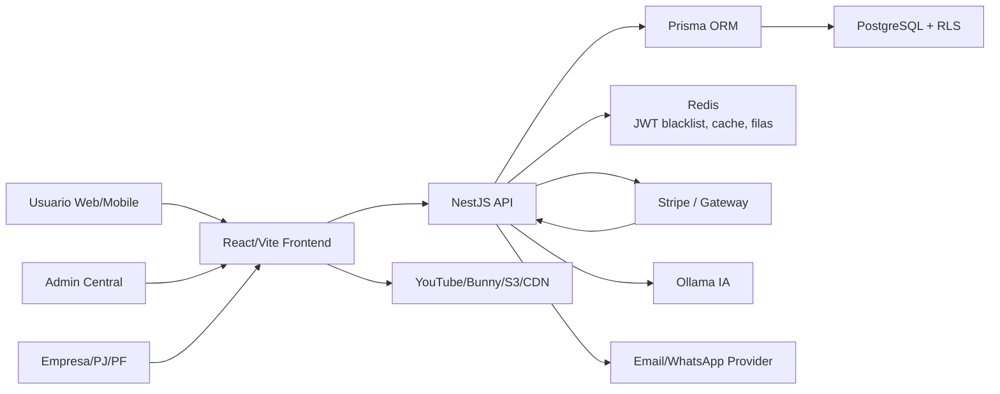
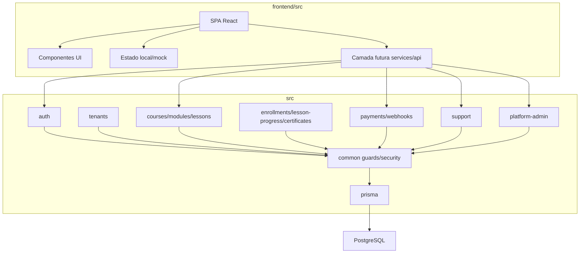
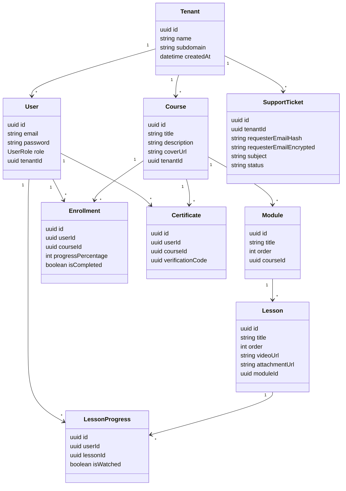
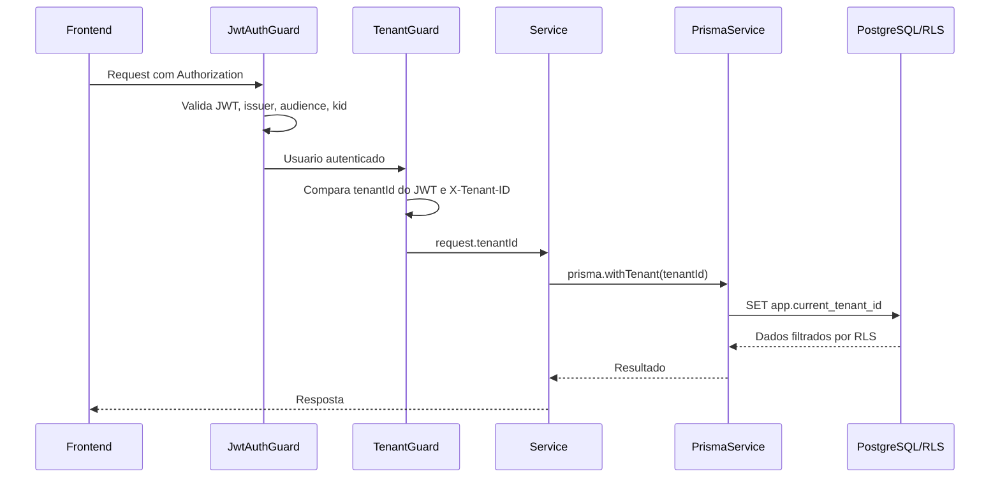
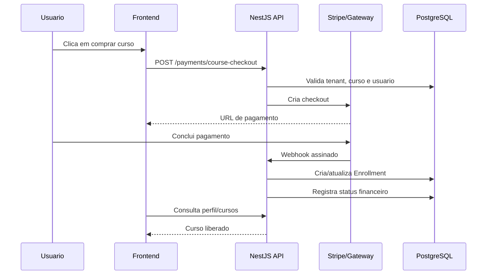
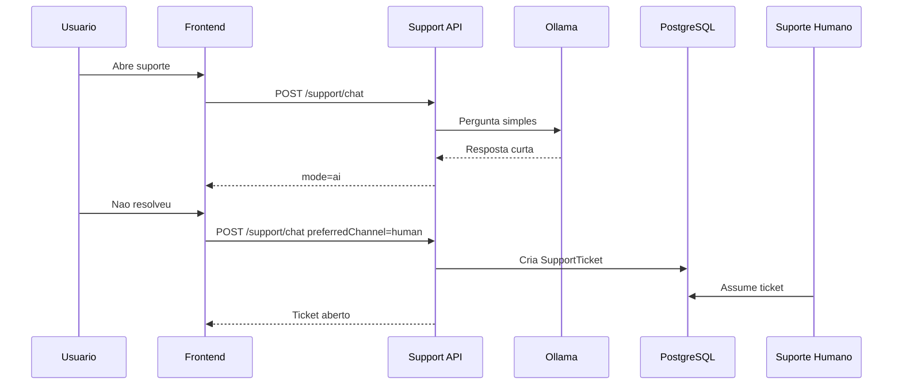

# Arquitetura e UML

Este documento descreve a arquitetura alvo da plataforma MeetPoint/CoreAcademy.
Ele separa o que ja esta estruturado no codigo do que ainda depende de banco,
infraestrutura e integracoes reais.

## Visao Executiva

A arquitetura correta para o produto e:

- frontend React/Vite separado do backend;
- backend NestJS modular;
- PostgreSQL como banco principal;
- Prisma como camada de acesso;
- isolamento multi-tenant por `tenantId` e RLS;
- JWT para autenticacao;
- Redis para revogacao de token, cache, filas e rate limit futuro;
- Stripe ou gateway equivalente para pagamentos;
- storage/CDN externo para videos, PDFs e documentos;
- IA de suporte via Ollama ou provedor substituivel.

## Status de Conexao

| Area | Status atual | Risco | Proximo passo |
| --- | --- | --- | --- |
| Frontend | Funcional, com muitos fluxos mockados | Medio | Trocar mocks por chamadas API por modulo |
| Backend NestJS | Modular e compilando | Baixo/medio | Ampliar endpoints para feed, comunidades, eventos e oportunidades |
| PostgreSQL/Prisma | Schema, migrations e RLS preparados | Medio | Conectar banco definitivo e rodar `migrate deploy` |
| Auth/JWT | Estrutura criada | Medio | Remover login demo em producao e testar revogacao |
| Stripe | Estrutura preparada | Medio/alto | Configurar chaves, webhooks e testes E2E |
| Suporte IA/Humano | Fluxo frontend + endpoint backend | Medio | Persistir tickets no banco real e painel operacional |
| CI/CD | Base criada | Medio | Configurar secrets e ambientes GitHub |

## UML de Contexto

## UML de Componentes

## UML de Dominio

## Fluxo de Requisicao Tenant

## Fluxo de Compra

## Fluxo de Suporte IA/Humano

## Fronteiras de Seguranca

| Fronteira | Controle esperado |
| --- | --- |
| Browser -> API | JWT, CORS restrito, rate limit, validacao DTO |
| API -> Banco | Prisma, `withTenant`, RLS, usuario sem bypass |
| API -> Stripe | webhook assinado, idempotencia |
| API -> Ollama | allowlist de origem, timeout, sem PII |
| API -> Storage | URLs assinadas e expiracao |
| Admin -> Dados sensiveis | RBAC/ABAC, mascaramento, auditoria |

## Pontos que Ainda Precisam Virar API Real

- feed, posts, comentarios, reacoes e algoritmo;
- comunidades, membros, mensagens e moderacao;
- conversas privadas;
- oportunidades e candidaturas;
- eventos e inscricoes;
- beneficios e resgates;
- pontos e ranking;
- perfil social completo;
- notificacoes.

Essas areas hoje estao funcionais no prototipo visual, mas devem ser migradas
para endpoints versionados antes de producao.
