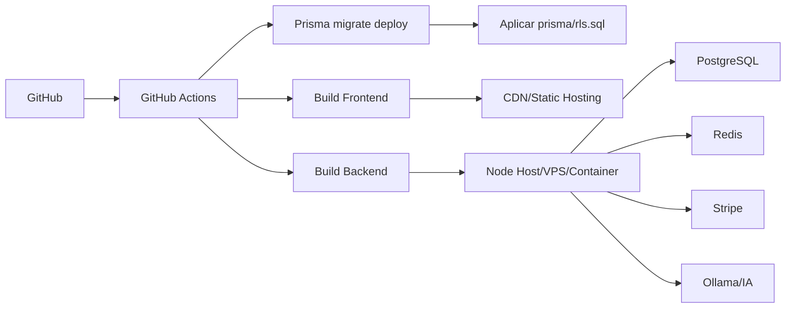

# Deploy, CI/CD e Ambientes

Este documento define como publicar a plataforma sem travar evolucoes futuras.
Ele considera NestJS, React/Vite, Prisma, PostgreSQL, JWT e integracoes externas.

## Ambientes

| Ambiente | Branch | Objetivo | Deploy |
| --- | --- | --- | --- |
| Local | qualquer | desenvolvimento | manual |
| Staging | `develop` | homologacao e testes com dados controlados | automatico ou manual |
| Production | `main`/tag | usuarios reais | manual com aprovacao |

## Arquitetura de Deploy Recomendada



## Opcao ValueHost

ValueHost pode servir para MVP se o plano suportar:

- Node.js;
- PostgreSQL;
- SSH ou terminal;
- variaveis de ambiente;
- processo Node persistente.

Para producao com alta escala, a alternativa superior e:

- frontend em CDN/static hosting;
- backend em VPS/container/cloud;
- PostgreSQL gerenciado ou servidor dedicado;
- storage/CDN separado para midias.

## Ordem Correta de Deploy

1. Instalar dependencias com `npm ci`.
2. Validar lint e build.
3. Gerar Prisma Client.
4. Rodar `prisma migrate deploy`.
5. Aplicar `prisma/rls.sql`.
6. Build do backend.
7. Build do frontend.
8. Publicar artefatos.
9. Executar smoke tests.
10. Monitorar logs e metricas.

## Comandos Base

```bash
npm ci
npm run lint
npm run build
npm run frontend:build
npx prisma migrate deploy
npx prisma db execute --schema prisma/schema.prisma --file prisma/rls.sql
```

## Secrets por Ambiente

### Staging

```text
STAGING_DATABASE_URL
STAGING_DEPLOY_WEBHOOK_URL
STAGING_DEPLOY_WEBHOOK_TOKEN
```

### Production

```text
PRODUCTION_DATABASE_URL
PRODUCTION_DEPLOY_WEBHOOK_URL
PRODUCTION_DEPLOY_WEBHOOK_TOKEN
JWT_ALGORITHM
JWT_PRIVATE_KEY
JWT_PUBLIC_KEY
JWT_KID
JWT_ISSUER
JWT_AUDIENCE
PII_ENCRYPTION_KEY
REDIS_URL
STRIPE_SECRET_KEY
STRIPE_WEBHOOK_SECRET
CORS_ORIGIN
CHECKOUT_ALLOWED_ORIGINS
```

## Workflows Criados

```text
.github/workflows/ci.yml
.github/workflows/security.yml
.github/workflows/deploy-staging.yml
.github/workflows/deploy-production.yml
```

### CI

Executa:

- `npm ci`;
- `npm run lint`;
- `npm run build`;
- `npm run frontend:build`;
- `npx prisma validate`.

### Security

Executa:

- `npm audit`;
- Gitleaks;
- Semgrep OWASP/TypeScript/secrets.

### Deploy Staging

Dispara em `develop` ou manualmente.

O workflow:

- valida build;
- gera artefatos;
- roda migrations/RLS se `STAGING_DATABASE_URL` existir;
- chama webhook de deploy se configurado.

### Deploy Production

Dispara por release publicada ou manualmente.

O workflow:

- exige ambiente `production`;
- valida build;
- gera artefatos;
- roda migrations/RLS se `PRODUCTION_DATABASE_URL` existir;
- chama webhook de deploy se configurado.

## Smoke Tests Minimos

Depois do deploy:

```text
GET /
GET /docs somente se ENABLE_SWAGGER=true
POST /auth/register com dados validos
POST /auth/login com usuario real
GET /tenants/current com JWT valido
POST /support/chat
POST /payments/course-checkout com tenant valido
```

## Rollback

Rollback deve considerar codigo e banco separadamente.

### Codigo

- reimplantar artefato anterior;
- ou reverter tag/release;
- ou hotfix direto em `main`.

### Banco

Prisma nao gera down migration automatica segura. Para producao:

- toda migration destrutiva precisa plano manual de rollback;
- preferir migrations expansivas;
- evitar remover coluna no mesmo release em que o codigo deixa de usar.

Padrao seguro:

```text
release 1: adicionar coluna nova
release 2: migrar escrita/leitura
release 3: remover coluna antiga
```

## Observabilidade Minima

Antes de producao:

- logs estruturados;
- request id;
- log sem token, senha, CPF, RG, email aberto ou documento;
- alertas para erro 5xx;
- alertas para webhook falhando;
- metricas de tempo de resposta;
- backup automatico do banco.

## Decisao

O projeto deve iniciar com deploy simples, mas sem amarrar arquitetura:

```text
Frontend estatico + Backend Node + PostgreSQL + Redis futuro + Storage/CDN externo
```

Esse desenho permite comecar rapido e migrar para AWS, VPS, container ou outro
provedor sem reescrever o produto.
