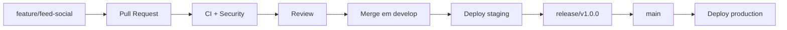

# GitFlow e Organizacao de Branches

Este projeto deve evitar desenvolvimento direto em `main`. A regra principal e
separar producao, homologacao e trabalho diario para reduzir conflito e risco.

## Modelo Recomendado

```text
main                 producao estavel
develop              homologacao/staging
feature/nome-curto   nova funcionalidade
fix/nome-curto       correcao comum
hotfix/nome-curto    correcao urgente em producao
release/vX.Y.Z       congelamento de versao
```

## Fluxo Normal de Feature



Passos:

```bash
git checkout develop
git pull
git checkout -b feature/nome-da-feature
```

Depois:

```bash
git add -A
git commit -m "feat: descreve a funcionalidade"
git push -u origin feature/nome-da-feature
```

Abra Pull Request para `develop`.

## Hotfix

Use hotfix apenas quando producao estiver quebrada.

```bash
git checkout main
git pull
git checkout -b hotfix/corrige-pagamento
```

Depois do merge em `main`, aplique tambem em `develop`:

```bash
git checkout develop
git pull
git merge main
git push
```

## Release

Quando `develop` estiver validado:

```bash
git checkout develop
git pull
git checkout -b release/v1.0.0
```

Nesta branch entram apenas:

- correcoes de bug;
- ajuste de documentacao;
- alteracao de versao;
- ajustes de configuracao de deploy.

Depois:

```bash
git checkout main
git merge release/v1.0.0
git tag v1.0.0
git push origin main --tags
```

## Padrao de Commits

Use Conventional Commits:

```text
feat: adiciona criacao de eventos
fix: corrige menu mobile no rodape
ui: aplica efeito glass em paineis
security: endurece validacao de webhook
docs: adiciona arquitetura e gitflow
ci: separa workflow de build e seguranca
chore: atualiza dependencias
```

## Regras de Pull Request

Todo PR deve ter:

- objetivo claro;
- prints ou video curto quando alterar UI;
- checklist de testes executados;
- impacto em banco, se houver;
- impacto em seguranca, se houver;
- link para issue/tarefa, quando existir.

Checklist minimo:

```text
- [ ] npm run lint
- [ ] npm run build
- [ ] npm run frontend:build
- [ ] Fluxo principal testado no navegador
- [ ] Sem secrets ou .env no diff
```

## Protecao de Branch

Configure no GitHub:

### `main`

- bloquear push direto;
- exigir PR;
- exigir CI verde;
- exigir Secret Scan verde;
- exigir pelo menos 1 aprovacao;
- exigir branch atualizada;
- exigir deploy production manual/environment approval.

### `develop`

- exigir PR;
- exigir CI verde;
- exigir Secret Scan verde;
- permitir merge squash.

## Como Evitar Conflitos

- dividir features grandes em PRs menores;
- evitar mexer em `frontend/src/main.jsx` para tudo no longo prazo;
- extrair componentes por dominio;
- separar `services/api` no frontend;
- nunca misturar refatoracao grande com feature de produto;
- nunca commitar `frontend/dist`, `.env`, logs ou arquivos temporarios;
- manter migrations pequenas e com nome claro.

## Padrao de Pastas Futuro

Frontend recomendado:

```text
frontend/src/
  app/
  components/
  features/
    feed/
    courses/
    communities/
    events/
    opportunities/
    profile/
    support/
  services/
    api/
  styles/
```

Backend recomendado:

```text
src/
  auth/
  tenants/
  feed/
  communities/
  courses/
  events/
  opportunities/
  benefits/
  support/
  platform-admin/
  common/
```

## Politica de Migrations

- desenvolvimento local: `prisma migrate dev`;
- staging/producao: `prisma migrate deploy`;
- nunca usar `prisma db push` em producao;
- RLS deve ser aplicada depois das migrations;
- toda migration que muda dados sensiveis precisa plano de rollback.

## Decisao

Para este projeto, o melhor fluxo e uma variacao enxuta de GitFlow:

```text
feature/* -> develop -> release/* -> main
hotfix/* -> main -> develop
```

Isso da controle suficiente sem criar burocracia excessiva.
